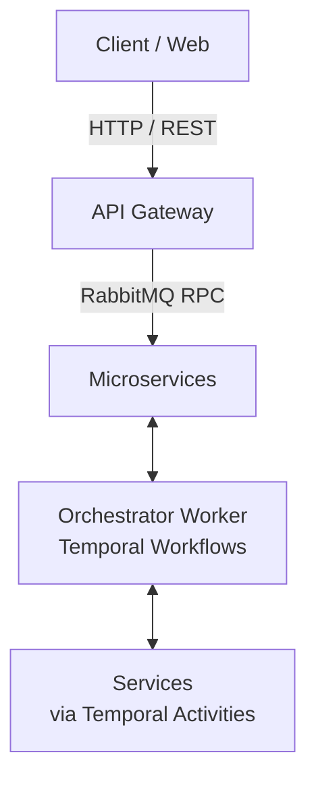

# NestJS Microservices with Temporal Monorepo

## 🎯 Overview

This project is a scalable, robust **microservices architecture** built with **NestJS** in a monorepo workspace. It leverages **RabbitMQ** for high-performance internal service-to-service communication (RPC & Events), **Temporal.io** for orchestrating complex distributed workflows (Saga pattern), and **PostgreSQL** with **TypeORM** for data persistence.

---

## 🚀 Microservices Architecture (`apps/`)

| Service | Role | Database | Temporal Activity |
| :--- | :--- | :---: | :---: |
| `api-gateway` | HTTP REST entrypoint, routes requests to microservices via RabbitMQ | ❌ | ❌ |
| `order-service` | Order management (CRUD, status updates) | ✅ | ✅ |
| `inventory-service` | Inventory management (reserve, confirm, release, restore) | ✅ | ✅ |
| `payment-service` | Payment processing via Stripe (charge, refund) | ✅ | ✅ |
| `shipping-service` | Shipment creation and tracking | ✅ | ✅ |
| `product-service` | Product catalog management and validation | ✅ | ✅ |
| `user-service` | User management and authentication | ✅ | ❌ |
| `orchestrator-worker` | Executes Temporal workflows (Saga orchestrator) | ❌ | ❌ |

---

## 📚 Shared Libraries (`libs/`)

| Library | Path Alias | Description |
| :--- | :--- | :--- |
| `auth` | `@libs/auth` | JwtAuthGuard, RolesGuard, `@Public()` and `@Roles()` decorators |
| `common` | `@libs/common` | Logger, Correlation ID context, global filters, utilities |
| `contract` | `@libs/contract` | Cross-service DTOs (`/dto`) and Enums (`/enum`) |
| `messaging` | `@libs/messaging` | `RmqPublisherService`, RabbitMQ module, context interceptor |
| `temporal` | `@libs/temporal` | Activity interfaces, Task Queue enums, shared Temporal module |

---

## 🔗 Communication Flow



1. **Client ↔ API Gateway**: HTTP/REST endpoints with JWT Authentication & Rate Limiting.
2. **API Gateway ↔ Microservices**: RabbitMQ RPC (`RmqPublisherService.request<T>`) & Event Publishing (`RmqPublisherService.publish`).
3. **Orchestrator ↔ Microservices**: Temporal Activities with dedicated task queues per service.

---

## 🛡️ Key Architectural Rules

- **Strict Service Isolation**: Microservices are NOT allowed to import files directly from other services (`apps/`). All shared contracts must reside in `@libs/contract`.
- **Controller Boundary**: `.controller.ts` files are ONLY allowed in `apps/api-gateway`. Microservices handle internal RPC via `@RabbitRPC()` message handlers.
- **Context Propagation**: `X-Correlation-Id` and `X-User-Id` are automatically propagated across HTTP, RabbitMQ, and Temporal calls via NestJS CLS (`ClsService`).
- **Saga Pattern**: Distributed transactions spanning multiple services use Temporal Saga workflows with compensation logic.

---

## 🤖 MCP (Model Context Protocol) Configuration

Local MCP servers are configured in `.agents/mcp_config.json`:
- `mcp-product-service-db`
- `mcp-order-service-db`
- `mcp-inventory-service-db`
- `mcp-payment-service-db`
- `mcp-user-service-db`
- `mcp-shipping-service-db`
- `mcp-stripe` (Loads `STRIPE_SECRET_KEY` automatically from `/.env` via `dotenv-cli`)

---

## 📦 Run the Project

### 1. Infrastructure Setup
```bash
# Start PostgreSQL, RabbitMQ, Redis, and Temporal
docker-compose up -d
```

### 2. Environment Setup
```bash
cp .env.example .env
```

### 3. Start Microservices (Development Watch Mode)
```bash
pnpm install

# Start services as needed:
pnpm run start:dev api-gateway
pnpm run start:dev user-service
pnpm run start:dev product-service
pnpm run start:dev order-service
pnpm run start:dev orchestrator-worker
```
