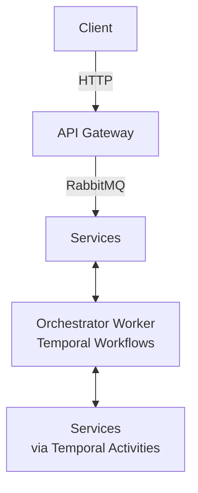

# Project Structure — NestJS Monorepo

## 📂 Top-Level Layout

```
├── apps/                    ← Microservices (each is a standalone NestJS app)
├── libs/                    ← Shared libraries across services
├── docker-compose.yml       ← Infrastructure services (PostgreSQL, Temporal, RabbitMQ...)
├── nest-cli.json            ← Monorepo project definitions
└── package.json             ← Shared dependencies & scripts
```

## 🚀 Services (`apps/`)

| Service                  | Vai trò                                                           | Có DB | Có Activity |
| ------------------------ | ----------------------------------------------------------------- | ----- | ----------- |
| `api-gateway`            | HTTP entrypoint, route requests to internal services via RabbitMQ | ❌    | ❌          |
| `order-service`          | Quản lý đơn hàng (CRUD, status updates)                           | ✅    | ✅          |
| `inventory-service`      | Quản lý tồn kho (reserve, confirm, release, restore)              | ✅    | ✅          |
| `payment-service`        | Xử lý thanh toán (charge, refund)                                 | ❌    | ✅          |
| `shipping-service`       | Tạo và quản lý vận chuyển                                         | ❌    | ✅          |
| `product-service`        | Quản lý sản phẩm (CRUD, validation)                               | ✅    | ✅          |
| `recommendation-service` | Gợi ý sản phẩm                                                    | ❌    | ❌          |
| `orchestrator-worker`    | Chạy Temporal workflows (KHÔNG phải HTTP service)                 | ❌    | ❌          |

### Standard Service Structure

```
apps/<service-name>/src/
├── main.ts                           ← Bootstrap & connect to RabbitMQ
├── <service-name>.module.ts          ← Root module
├── <service-name>.controller.ts      ← RabbitMQ message handler (nếu có)
├── <service-name>.service.ts         ← Business logic (nếu có)
├── activity/                         ← Temporal activity implementations (nếu có)
├── entity/                           ← TypeORM entities (nếu có DB)
└── repository/                       ← Data access layer (nếu có DB)
```

### API Gateway Structure

```
apps/api-gateway/src/
├── main.ts                           ← HTTP server bootstrap
├── api-gateway.module.ts             ← Root module
└── modules/                          ← Feature modules (order, product, etc.)
    └── <feature>/
        ├── <feature>.controller.ts   ← REST endpoints
        ├── <feature>.module.ts
        └── <feature>.service.ts      ← Proxy to internal services via RabbitMQ
```

## 📚 Shared Libraries (`libs/`)

| Library    | Path alias       | Mục đích                                                      |
| ---------- | ---------------- | ------------------------------------------------------------- |
| `common`   | `@libs/common`   | Shared enums, logger, utilities, decorators                   |
| `contract` | `@libs/contract` | DTOs và enums dùng chung giữa services (data contracts)       |
| `temporal` | `@libs/temporal` | Activity interfaces, task queue enums, shared Temporal module |

### Key Rules

- **DTOs** shared giữa services → đặt trong `libs/contract/src/<domain>/dto/`.
- **Enums** shared → đặt trong `libs/contract/src/<domain>/enum/` hoặc `libs/common/src/enum/`.
- **Activity interfaces** → đặt trong `libs/temporal/src/activity/interface/`.
- Code chỉ dùng bởi 1 service → giữ trong `apps/<service>/src/`, KHÔNG đưa vào `libs/`.

## 🔗 Communication Flow



- **Client ↔ API Gateway**: HTTP/REST
- **API Gateway ↔ Services**: RabbitMQ (request/response pattern)
- **Orchestrator ↔ Services**: Temporal Activities (each service has its own task queue)
