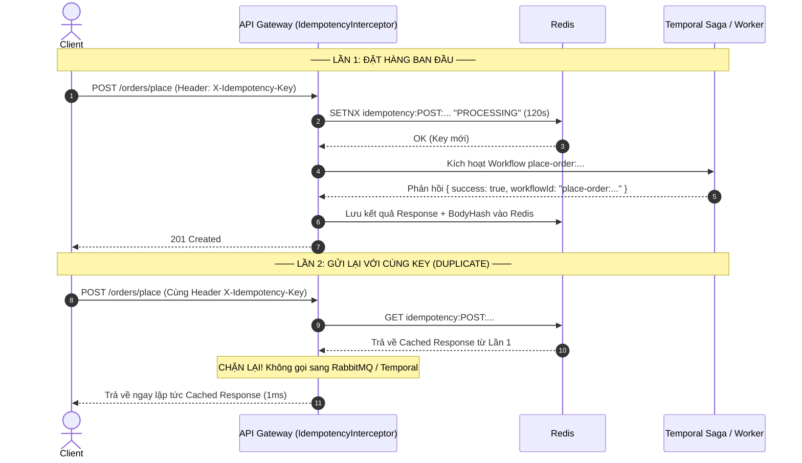

# Idempotency Processing Business Flow

## 🎯 Overview

This document describes the request execution flow and deduplication mechanism for Idempotent API endpoints using `@Idempotent()` decorator, `IdempotencyInterceptor`, and Redis.

---

## 📊 Sequence Diagram

Raw diagram file: [.docs/idempotency-flow.mermaid](idempotency-flow.mermaid)
