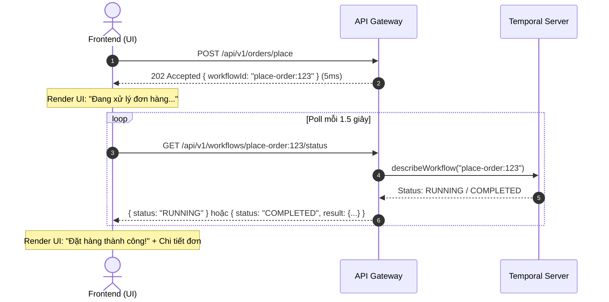

# Specification: Generic Temporal Workflow Status Polling API

## 🎯 Overview

This specification documents the design, architecture, and implementation details for a **Generic Workflow Status Polling API** (`GET /api/v1/workflows/:workflowId/status`) at the `api-gateway` layer.

This API allows clients (Frontend / Mobile) to poll the execution status and retrieve final results of long-running, asynchronous Temporal Saga Workflows (e.g., `placeOrderWorkflow`) without coupling status checks to domain-specific microservices or blocking HTTP connections.

---

## ❓ Problem & Rationale

### 💥 Asynchronous Workflows & Timeout Risks
Complex business workflows involving third-party integrations (e.g., Stripe payments, inventory reservations, shipping creation) can take several seconds or experience retries.
- Synchronously awaiting workflow completion (`await getWorkflowResult()`) on HTTP request handlers leads to **HTTP 504 Gateway Timeouts** and **connection exhaustion** during high-concurrency bursts.
- Returning `202 Accepted` with a `workflowId` immediately releases the HTTP socket (in 5ms), enabling safe execution regardless of workflow retries or third-party latency.

### 🚀 Generic API Gateway Querying
By using `TemporalService` directly at the API Gateway:
1. **Zero Database Load**: Status queries hit Temporal Server directly (`describe()`), bypassing PostgreSQL databases.
2. **Universal Reuse**: A single generic endpoint handles ALL workflows across the monorepo (`place-order:*`, `import-inventory:*`, `export-report:*`, etc.).

---

## 📊 Sequence Diagram



---

## 🛠️ API Design & Specification

### Endpoint Signature
- **URL Path**: `GET /api/v1/workflows/:workflowId/status`
- **Authentication**: `@Public()` (or JWT protected depending on workflow privacy rules)
- **Parameters**: `workflowId` (string, required)

### Response Structure

#### 1. Workflow Running (`RUNNING`)
```json
{
  "workflowId": "place-order:fa3d84fc-e141-4325-af15-7c6b71caa106",
  "status": "RUNNING",
  "message": "Workflow is currently executing"
}
```

#### 2. Workflow Completed (`COMPLETED`)
```json
{
  "workflowId": "place-order:fa3d84fc-e141-4325-af15-7c6b71caa106",
  "status": "COMPLETED",
  "result": {
    "orderId": 4930,
    "status": "SHIPPING",
    "shipmentId": 521,
    "paymentId": 1021
  }
}
```

#### 3. Workflow Closed / Failed (`FAILED`, `CANCELLED`, `TERMINATED`)
```json
{
  "workflowId": "place-order:fa3d84fc-e141-4325-af15-7c6b71caa106",
  "status": "FAILED",
  "message": "Workflow closed with status FAILED"
}
```

---

## 💻 Technical Code Reference

### 1. `apps/api-gateway/src/workflow/workflow.service.ts`

```typescript
import { Injectable, InternalServerErrorException, Logger, NotFoundException } from '@nestjs/common';
import {
  WorkflowExecutionDescription,
  WorkflowExecutionStatusName,
  WorkflowFailedError,
  WorkflowNotFoundError,
} from '@temporalio/client';
import { TemporalService, Workflow, WorkflowHandle } from 'nestjs-temporal-core';

@Injectable()
export class WorkflowService {
  private readonly logger = new Logger(WorkflowService.name);

  constructor(private readonly temporalService: TemporalService) {}

  async getWorkflowStatus(workflowId: string): Promise<any> {
    try {
      const handle: WorkflowHandle<Workflow> = await this.temporalService.client.getWorkflowHandle(workflowId);
      const description: WorkflowExecutionDescription = await handle.describe();
      const workflowStatus: WorkflowExecutionStatusName = description.status.name;

      if (workflowStatus === 'COMPLETED') {
        const result: unknown = await this.temporalService.client.getWorkflowResult(workflowId);

        return {
          workflowId,
          status: workflowStatus,
          result,
        };
      }

      if (workflowStatus === 'RUNNING') {
        return {
          workflowId,
          status: workflowStatus,
          message: 'Workflow is currently executing',
        };
      }

      return {
        workflowId,
        status: workflowStatus,
        message: `Workflow closed with status ${workflowStatus}`,
      };
    } catch (error) {
      if (error instanceof WorkflowFailedError) {
        this.logger.error(error.message);
        throw new InternalServerErrorException(`Workflow '${workflowId}' failed`);
      } else if (error instanceof WorkflowNotFoundError) {
        this.logger.error(error.message);
        throw new NotFoundException(`Workflow '${workflowId}' not found`);
      }

      throw error;
    }
  }
}
```

### 2. `apps/api-gateway/src/workflow/workflow.controller.ts`

```typescript
import { Public } from '@libs/auth';
import { Controller, Get, Param } from '@nestjs/common';
import { ApiNotFoundResponse, ApiOkResponse, ApiOperation, ApiParam, ApiTags } from '@nestjs/swagger';
import { WorkflowService } from './workflow.service';

@ApiTags('Workflow')
@Controller('workflows')
export class WorkflowController {
  constructor(private readonly workflowService: WorkflowService) {}

  @Get(':workflowId/status')
  @Public()
  @ApiParam({ name: 'workflowId', required: true, description: 'Workflow ID' })
  @ApiOperation({ summary: 'Get generic workflow execution status for polling' })
  @ApiOkResponse({ description: 'Current workflow status and result if completed' })
  @ApiNotFoundResponse({ description: 'Workflow not found' })
  getWorkflowStatus(@Param('workflowId') workflowId: string): Promise<any> {
    return this.workflowService.getWorkflowStatus(workflowId);
  }
}
```

### 3. `apps/api-gateway/src/workflow/workflow.module.ts`

```typescript
import { SharedTemporalModule } from '@libs/temporal/shared-temporal.module';
import { Module } from '@nestjs/common';
import { WorkflowController } from './workflow.controller';
import { WorkflowService } from './workflow.service';

@Module({
  imports: [SharedTemporalModule.forRoot()],
  controllers: [WorkflowController],
  providers: [WorkflowService],
})
export class WorkflowModule {}
```

---

## 📌 Implementation Checklist When Deferred

When resuming the implementation of this feature in the future:
1. Register `WorkflowModule` in `apps/api-gateway/src/api-gateway.module.ts`.
2. Ensure `TEMPORAL_HOST` and `TEMPORAL_NAMESPACE` environment variables are loaded in `api-gateway`.
3. Verify Swagger documentation displays the `/api/v1/workflows/{workflowId}/status` route.
